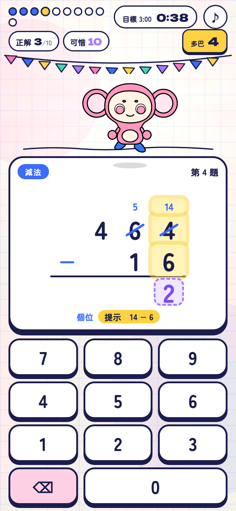
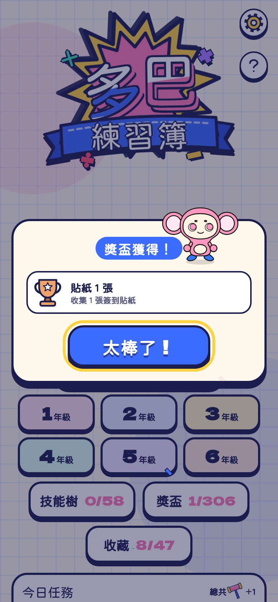
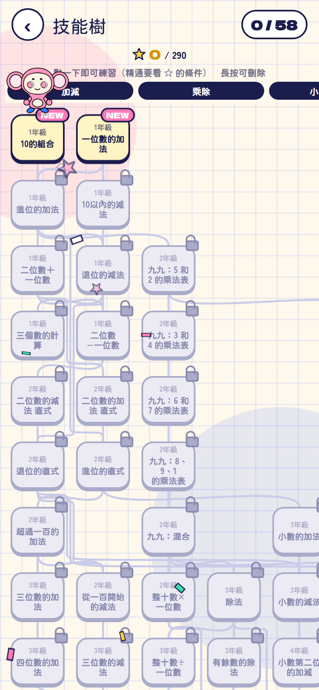

# 多巴練習簿 · Dopa Drill 繁體中文版

[](LICENSE)
[](#)
[](#)
[](#測試)
[](https://github.com/grmchn/dopa-drill)

> 每解一題數學，畫面和音樂就越來越誇張的計算練習簿。純瀏覽器執行，沒有後端、沒有追蹤、不用安裝。

**線上遊玩：<https://maths.aut0.app/>**



這是 [grmchn/dopa-drill（ドパドリル）](https://github.com/grmchn/dopa-drill) 的**非官方繁體中文版**：介面、文件與字型全部改為繁體中文（港台用語），遊戲設計與程式邏輯沿用上游。

## 這是什麼

數學練習最怕無聊。這本練習簿把每一題都變成表演：吉祥物「多巴基」會把輸入的數字搬上台，答對就放煙火、奏樂、撒紙花。題目越做越多，畫面和音效就越熱鬧，最後整頁像祭典一樣。答錯不會中斷氣勢，也沒有 Game Over。

## 特點

- **58 個計算技能，涵蓋國小 1～6 年級**：加減乘除、直式（含進位／退位）、小數、分數、約分通分、概數、百分率、相等的比、未知數等
- **「我的程度」模式**：先做程度測驗，再依熟練度自動解鎖下一個技能
- **年級模式、練習、複習、技能樹、獎盃、收藏、日曆、今日任務、簽到獎勵**
- **計分**：全對 100 分；首次答對率 80% 以上可進入限時「加碼關」，挑戰破 100 的分數
- **音樂與音效全部由 Web Audio API 即時合成**（專案內沒有任何音訊檔案）
- **手機直向與電腦都支援**；電腦可用數字鍵與 Backspace 作答
- **設定可調整動態強度與音量**，也能完全靜音
- **所有紀錄只存在裝置的 localStorage**，不對外傳送任何資料

## 本版改動（相對上游）

| 項目 | 改動 |
| --- | --- |
| 介面文字 | 全部日文改為繁體中文；數學術語採台灣國小用法（進位／退位、直式、餘數、帶分數、概數、約分、通分、相等的比） |
| 文件 | `README`、`docs/SPEC.md`、`docs/curriculum.md` 全部翻譯；上游日文原文保留在 [`docs/README.upstream.ja.md`](docs/README.upstream.ja.md) |
| 字型 | 新增 **jf open 粉圓**（OFL 1.1）子集 `app/fonts/jf-openhuninn.woff2`；中文字一律由中文字型呈現，Dela Gothic One 與 Zen Maru Gothic 只用於數字與英數，避免日文字形混進中文 |
| 語言標記 | `<html lang="ja">` → `<html lang="zh-Hant">`；數字與日期格式 `ja-JP` → `zh-Hant-TW` |
| 名稱 | 遊戲名 `ドパドリル` → **多巴練習簿**、吉祥物 `ドパキチ` → **多巴基**（只改顯示文字；技能 ID、產生器名稱、CSS class 等識別碼一律不動） |
| 測試 | 對應中文輸出的斷言已更新；另加入 31 項稽核強化測試（邊界矩陣、故障注入、狀態機單調性），`node --test` 89 項全部通過 |
| 工具 | `tools/build_fonts.sh` 增加中文字型子集流程（同時產生日文數字／英數子集） |
| 未改動 | 遊戲規則、題目產生器、計分、儲存格式、演出與音樂邏輯 |

## 遊玩方式（本機）

不需要建置，把 `app/` 當靜態目錄提供即可：

```bash
python3 -m http.server 8000 -d app
```

再開啟 `http://localhost:8000/`。因為使用 ES Modules，直接用 `file://` 打開無法運作。

## 測試

需要 Node.js 20 以上：

```bash
node --test tests/*.test.mjs
```

## 專案結構

| 路徑 | 內容 |
| --- | --- |
| `app/` | 遊戲本體（零依賴的 ES Modules） |
| `docs/SPEC.md` | 遊戲規格書 |
| `docs/curriculum.md` | 年級課程範圍、技能樹與出題條件 |
| `docs/README.upstream.ja.md` | 上游日文 README 原文 |
| `docs/images/` | 說明用截圖 |
| `docs/dopakichi.svg` | 吉祥物造型原稿 |
| `tests/` | 單元測試 |
| `tools/build_fonts.sh` | 重新產生字型子集（新增畫面文字後執行） |

## 畫面

| 開始畫面 | 技能樹 |
| --- | --- |
|  |  |

| 遊玩中 | 獎盃 |
| --- | --- |
|  |  |

## 字型

| 字型 | 用途 | 授權 |
| --- | --- | --- |
| jf open 粉圓（jf-openhuninn 2.1） | 中文介面文字 | SIL Open Font License 1.1（`app/fonts/OFL-jfOpenHuninn.txt`） |
| Dela Gothic One | 標題與數字 | SIL Open Font License 1.1（`app/fonts/OFL-DelaGothicOne.txt`） |
| Zen Maru Gothic | 數字與英數 | SIL Open Font License 1.1（`app/fonts/OFL-ZenMaruGothic.txt`） |

螢幕文字若有增減，請重新執行 `bash tools/build_fonts.sh` 產生新的字型子集。

## 授權與致謝

- 程式碼：**MIT License**（見 [`LICENSE`](LICENSE)）
- 吉祥物「多巴基」與作品名稱：沿用上游條款，**不在 MIT 範圍內**；非商業的二次創作可自由使用，商業用途需事先取得原作者同意
- 原始企劃、程式、美術與音樂：**[grmchn/dopa-drill](https://github.com/grmchn/dopa-drill)（© 2026 gear_machine）**
- 本專案為**非官方**翻譯版，與原作者無隸屬關係；翻譯或術語有誤，歡迎開 issue
